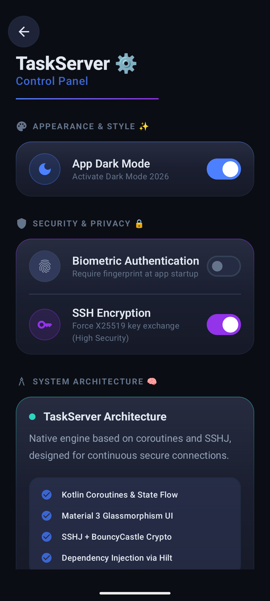
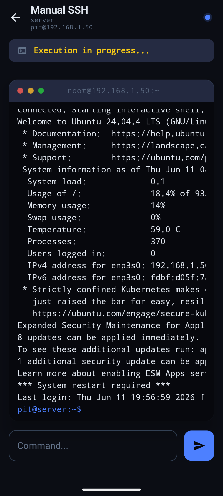

# 📱 Task Server
> **Automate your SSH workflow. Control your servers from anywhere.**

Task Server is an Android app designed by Pietro Olivero for anyone who manages 
servers and is tired of typing the same commands over and over. 
Save your servers, define your most-used tasks, and execute 
them with a single tap — or drop into a full SSH terminal 
whenever you need more control.

---

## ⚡ Quick Links

  
  &nbsp;&nbsp;&nbsp;&nbsp;
  

  💡 <b>Just want the app?</b> Click the green button to grab the latest <code>.apk</code> instantly.

---

## ✨ Features
- 🖥️ **Server Presets** — Save host, port, and credentials once. Connect instantly.
- ⚡ **Task Automation** — Define repetitive commands and launch them in one tap.
- 💻 **SSH Terminal** — Full classic SSH shell, always available.
- 🔐 **Sudo Support** — Run privileged commands when root access is needed.
- 📦 **Lightweight & Fast** — No bloat. Just your servers and your tasks.

---

## 🎯 Who is this for?
Anyone who manages servers from their phone:
- **Homelab enthusiasts** — restart services, check disk space, reboot machines
- **Developers** — deploy, restart daemons, tail logs on the go
- **NAS / home server owners** — quick maintenance without sitting at a desk
- **SysAdmins** — run common scripts without opening a laptop

---

## 📸 Screenshots

### 🛠️ Main Overview & Configuration
| Home | New Server | Edit/New Task | Settings | Settings |
| :---: | :---: | :---: | :---: | :---: |
|  |  |  |  |  |

### 💻 Connection & Management
| Servers List | Tasks List | SSH Dashboard | SSH Terminal | Activity Logs |
| :---: | :---: | :---: | :---: | :---: |
|  |  |  |  |  |

---

## 🚀 How to Install

1. **Download:** Click the [Latest APK](../../releases/latest) button at the top of this page.
2. **Permissions:** Enable *Install from unknown sources* in your Android settings if prompted.
3. **Launch:** Install the file and you're good to go — no account required.

---

## 🤝 Contributing
Found a bug? Have a feature idea? Open an [Issue](../../issues) or submit a Pull Request. All contributions are welcome!

---

## 📄 License
MIT License — Copyright (c) 2026 **Pietro Olivero** (Main Developer & Designer).
Free to use, modify and distribute.
