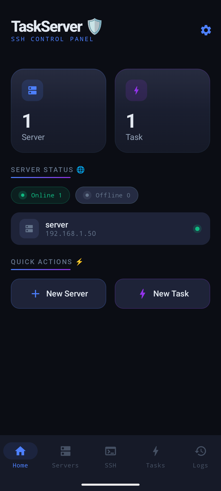
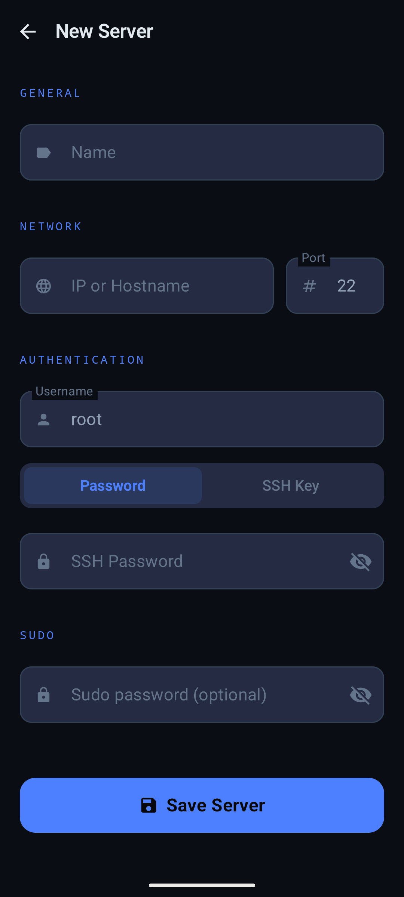
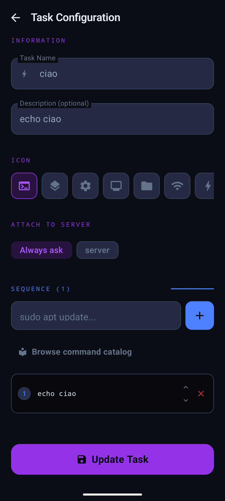
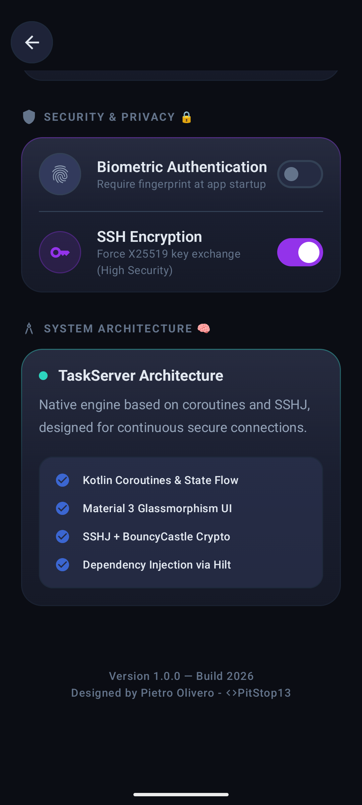
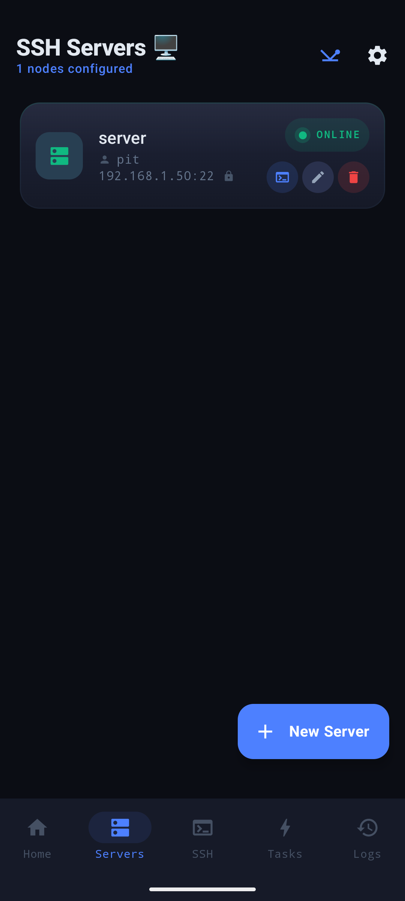
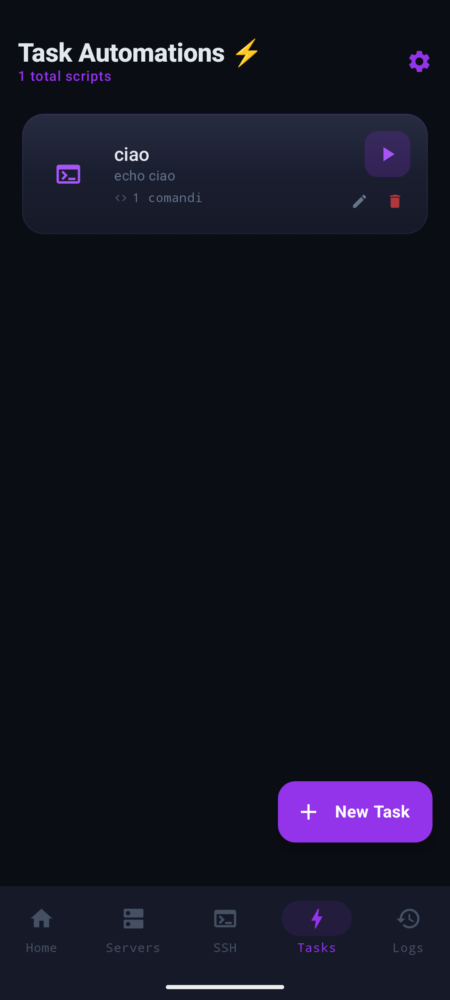
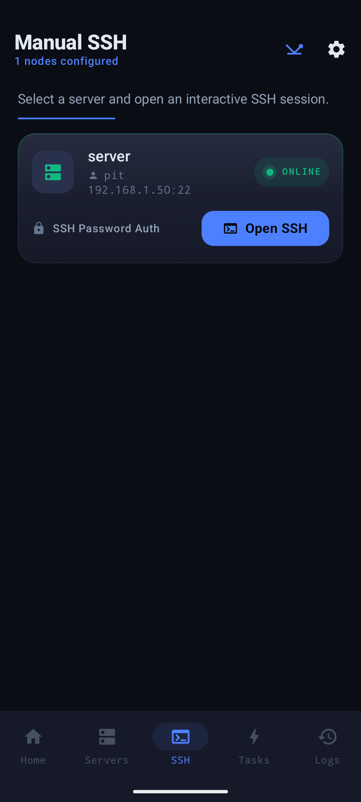
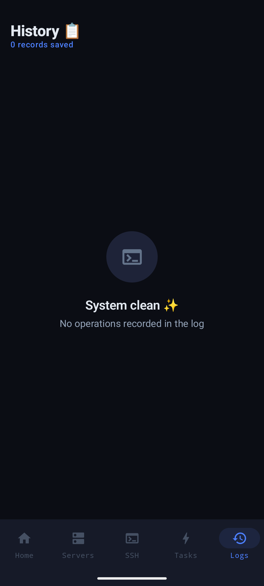

# 📱 Task Server
> **Automate your SSH workflow. Control your servers from anywhere.**

Task Server is an Android app designed for anyone who manages 
servers and is tired of typing the same commands over and over. 
Save your servers, define your most-used tasks, and execute 
them with a single tap — or drop into a full SSH terminal 
whenever you need more control.

---

## ⚡ Quick Download

> 💡 **Just want the app?** Click the button above to download the latest `.apk` file instantly from the Releases page.

---

## ✨ Features
- 🖥️ **Server Presets** — Save host, port, and credentials once. Connect instantly.
- ⚡ **Task Automation** — Define repetitive commands and launch them in one tap.
- 💻 **SSH Terminal** — Full classic SSH shell, always available.
- 🔐 **Sudo Support** — Run privileged commands when root access is needed.
- 📦 **Lightweight & Fast** — No bloat. Just your servers and your tasks.

---

## 🎯 Who is this for?
Anyone who manages servers from their phone:
- **Homelab enthusiasts** — restart services, check disk space, reboot machines
- **Developers** — deploy, restart daemons, tail logs on the go
- **NAS / home server owners** — quick maintenance without sitting at a desk
- **SysAdmins** — run common scripts without opening a laptop

---

## 📸 Screenshots

Di seguito una panoramica completa dell'interfaccia di Task Server, organizzata per sezioni principali. Tutti gli screenshot sono visualizzati in formato ridotto per risparmiare spazio mantenendo una buona leggibilità.

  <b>Panoramica Principale & Configurazione</b> 
  
  
  
  
  

  <b>Gestione & Connessione SSH</b> 
  
  
  
  
  

---

## 🚀 How to Install

1. **Download:** Click the [Latest APK](../../releases/latest) button at the top of this page.
2. **Permissions:** Enable *Install from unknown sources* in your Android settings if prompted.
3. **Launch:** Install the file and you're good to go — no account required.

---

## 🤝 Contributing
Found a bug? Have a feature idea? Open an [Issue](../../issues) or submit a Pull Request. All contributions are welcome!

---

## 📄 License
MIT License — free to use, modify and distribute.
